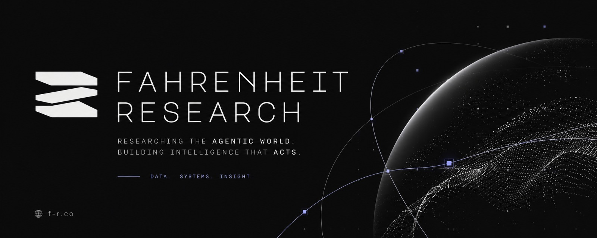

<div align="center">



</div>

# AgentBrain

**Advanced local memory system by Fahrenheit Research**

Entity graph • Temporal awareness • Hierarchical memory • Obsidian export • Automatic synthesis

## Why AgentBrain v2

AgentBrain v2 is a production-grade memory layer designed specifically for autonomous agents. It combines structured entity memory with temporal reasoning and intelligent memory tiering.

### Key Improvements over v1

- **Temporal Knowledge Graph** — Every relationship has validity windows
- **Hierarchical Memory Tiers** — Working, Episodic, Semantic, and Archive layers
- **Smart Context Management** — Actively manages what stays in the LLM context
- **Powerful Synthesis Engine** — Background consolidation with provenance tracking
- **Hermes Native** — Works seamlessly as a memory provider for Hermes Agent
- **Excellent Obsidian Integration** — Generates rich, time-aware graphs

## Attribution

**Created by Fahrenheit Research**

## Quick Start (Hermes)

```bash
hermes config set memory.provider agentbrain
```

## Quick Start (Standalone)

```bash
pip install agentbrain
```

```python
from agentbrain import AgentBrain

brain = AgentBrain()
brain.store("User prefers dark mode", entities=["User"], timestamp=...)
results = brain.recall("user preferences", limit=5)
```

## License

MIT License

© Fahrenheit Research